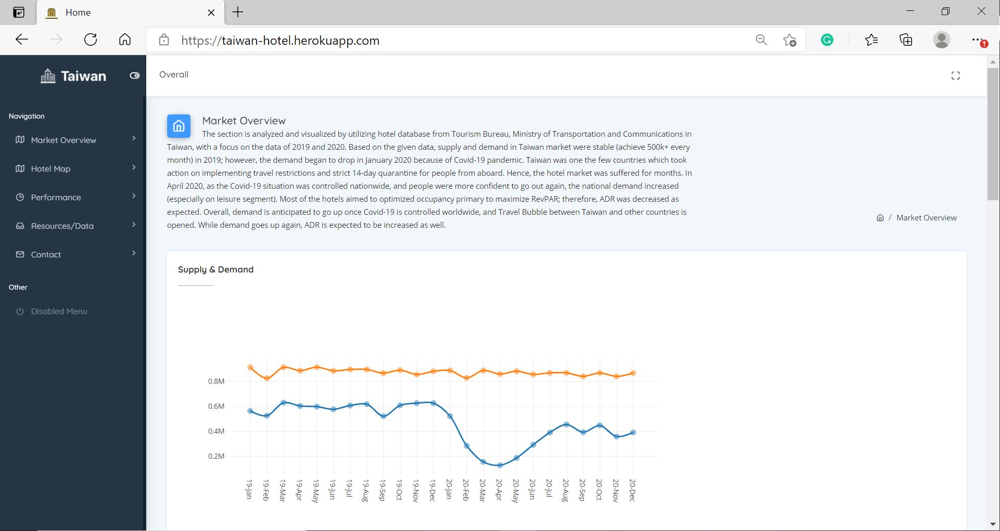

<!-- PROJECT LOGO -->
 

  

  <h3 align="center">Data Visualization and Market Overview for Taiwan Hotel Industry</h3>

  

     
    <a href="https://taiwan-hotel.herokuapp.com/"><strong>Explore the Website »</strong></a>
  

<!-- TABLE OF CONTENTS -->

  
Table of Contents

  <ol>
    <li>
      <a href="#about-the-project">About The Project</a>
    </li>
  </ol>

<!-- ABOUT THE PROJECT -->
## About The Project

<i> The website is to analyze Taiwan hotel market and to visualize data in a monthly basis for hoteliers to review competitors performance, pricing and seasonality from macro and micro prospectives, and for potential investors to receive basic information of current market trend in hotel industry.</i>

